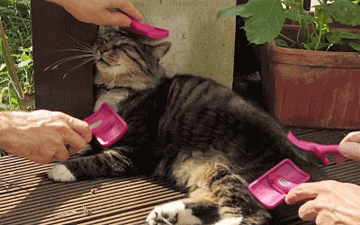

<h1>Problem Description</h1>
The goal of this project was to design an environment where little red squares (envisioned as spaceships in space) learn to avoid little grey squared (envisioned as meteors). Below is a demonstration of the best individual after x generations of training:

The whole population and the best individual of every fifth generation:

  <h1>How It Works</h1>
  
The red squares die if they are hit by one of the grey squares. However, the red squares can “see” a certain distance around themselves:

If a grey square overlaps with one of the green points, the red square will know that and will be able to decide where to move based on that. The red square will also know if one of the green points is outside the bounds of the map. To be able to make decisions the red square is equipped with a neural network that takes the state of the green points as inputs and outputs a decision:

The outputs can either be -1, 0 or 1. The numbers correspond to whether to decrease, leave unchanged or increase a coordinate. Output 1 controls the x-coordinate and output 2 the y-coordinate. If for example both outputs are ones, then the red square will move north east.
The red squares are rewarded based on how long they survive. When all the red squares die, the current generation ends and the squares that survived the longest are chosen as parents for the next generation. The weights of the parents’ neural networks are combined to produce new networks for the next generation.

Over many generations the red squares evolve through the process of artificial natural selection to eventually avoid the grey squares. In the end they become much better than a human at achieving the given task.

Source: <a href="https://github.com/alexeygorskiy/meteor_shower"><i class="large github icon"></i>alexeygorskiy/meteor_shower</a>

<!--

-->

<!--
Vacay is a web application that I helped create as a team project in ICS 415, Spring 2015. The project helped me learn how to design and implement a responsive web site.

Vacay is implemented using [Meteor](http://meteor.com), a JavaScript application platform. Within two weeks, we created a website that implements several types of reservations including flights, hotels, and car rentals.

In this project I gained experience with full-stack web application design and associated technologies, including [MongoDB](http://mongodb.com) for database storage, the [Twitter Bootstrap](http://getbootstrap.com/) CSS Framework for the user interface, and Javascript for both client and server-side programming.-->
