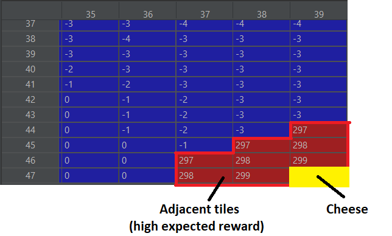
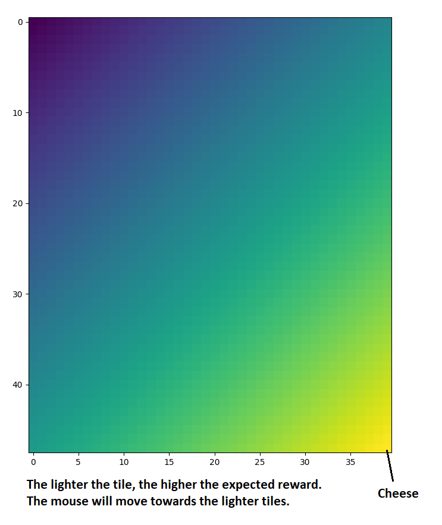

Source: <a href="https://github.com/alexeygorskiy/find_the_cheese"><i class="large github icon"></i>alexeygorskiy/find_the_cheese</a>

<h1>Problem Description</h1>
The goal of this project was to design an environment where a mouse learns to find the cheese. Below is a demonstration of the mouse after 30 games:

<video width="330" height="395" controls>
    <source src="../images/game_30.mp4" type="video/mp4">
  Your browser does not support the video tag.
</video>

<h1>Below are demonstrations of every 10th game (up to game 30):</h1>

<video width="330" height="395" controls>
    <source src="../images/game_0.mp4" type="video/mp4">
  Your browser does not support the video tag.
</video>

<video width="330" height="395" controls>
    <source src="../images/game_10.mp4" type="video/mp4">
  Your browser does not support the video tag.
</video>

<video width="330" height="395" controls>
    <source src="../images/game_20.mp4" type="video/mp4">
  Your browser does not support the video tag.
</video>

<video width="330" height="395" controls>
    <source src="../images/game_30.mp4" type="video/mp4">
  Your browser does not support the video tag.
</video>

<h1>How It Works</h1>
The mouse has a limited line of sight and in the beginning has no idea where or in which general direction the cheese is located. When it finds the cheese for the first time, it assigns a high value to the adjacent tiles marking that there is a high expected reward if you find yourself in one of those tiles:

The next time it finds itself in one of these tiles, it will remember that there is a high expected reward associated with those tiles and will thus move towards them. As the mouse explores the map, it will assign a value to every tile on the map that will be lower the further away the tile is from the cheese. After a number of games, the map will be explored and pretty much all the tiles will have an associated value of expected reward:

As such, the mouse will always move in the direction of increasing expected reward, i.e. towards the cheese, and will therefore always take the shortest path to the cheese from anywhere on the map.
